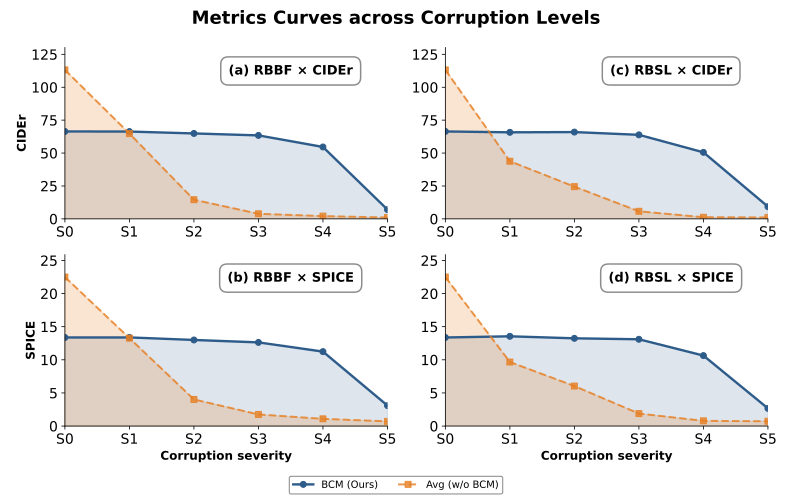
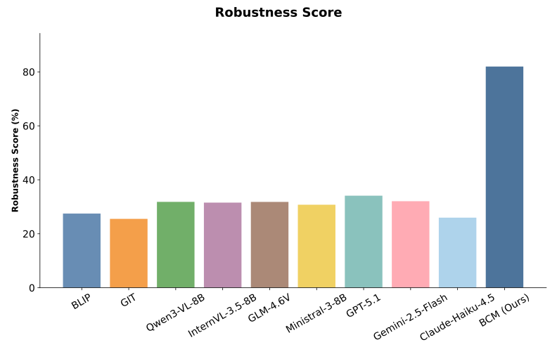

<table>
  <thead>
    <tr>
      <th rowspan="2">Model</th>
      <th colspan="6">RBBF</th>
    </tr>
    <tr>
      <th>S0</th>
      <th>S1</th>
      <th>S2</th>
      <th>S3</th>
      <th>S4</th>
      <th>S5</th>
    </tr>
  </thead>
  <tbody>
  <tr><th colspan="7">COCO Pretrained Models</th></tr>
  <tr><td>BLIP</td><td>121.5 / 21.2</td><td>45.6 / 9.8</td><td>8.4 / 2.9</td><td>5.4 / 2.6</td><td>3.2 / 1.5</td><td>1.3 / 0.6</td></tr>
  <tr><td>GIT</td><td>135.1 / 23.3</td><td>51.4 / 9.8</td><td>4.3 / 1.9</td><td>2.0 / 1.3</td><td>1.1 / 0.6</td><td>1.3 / 0.6</td></tr>
  <tr><th colspan="7">COCO Fine-Tuned Models</th></tr>
  <tr><td>Qwen3-VL-8B</td><td>127.0 / 23.5</td><td>81.9 / 15.8</td><td>21.7 / 5.5</td><td>4.5 / 2.0</td><td>2.4 / 1.2</td><td>1.0 / 0.7</td></tr>
  <tr><td>InternVL-3.5-8B</td><td>134.7 / <strong>24.0</strong></td><td>83.0 / 15.7</td><td>19.8 / 5.1</td><td>6.4 / 2.6</td><td>3.6 / 1.7</td><td>1.0 / 0.7</td></tr>
  <tr><td>GLM-4.6V</td><td><strong>136.7</strong> / <strong>24.0</strong></td><td><strong>86.2</strong> / 15.9</td><td>23.3 / 5.3</td><td>5.6 / 2.1</td><td>2.9 / 1.3</td><td>1.0 / 0.7</td></tr>
  <tr><td>Ministral-3-8B</td><td>111.0 / 20.6</td><td>68.9 / 13.5</td><td>14.7 / 3.9</td><td>4.1 / 1.6</td><td>2.7 / 1.1</td><td>1.0 / 0.7</td></tr>
  <tr><th colspan="7">Zero-Shot Generative Models</th></tr>
  <tr><td>GPT-5.1</td><td>77.9 / 19.1</td><td>55.5 / 14.0</td><td>16.7 / 5.1</td><td>3.0 / 1.4</td><td>1.0 / 0.8</td><td>1.0 / 0.7</td></tr>
  <tr><td>Gemini-2.5-Flash</td><td>119.3 / 23.4</td><td>81.1 / <strong>16.6</strong></td><td>18.5 / 4.9</td><td>3.0 / 1.4</td><td>1.1 / 0.8</td><td>1.0 / 0.7</td></tr>
  <tr><td>Claude-Haiku-4.5</td><td>55.5 / 23.4</td><td>29.5 / 8.3</td><td>3.5 / 1.5</td><td>1.0 / 0.7</td><td>1.0 / 0.7</td><td>1.0 / 0.7</td></tr>
  <tr><th colspan="7">Ours</th></tr>
  <tr><td>BCM (Ours)</td><td>66.4 / 13.4</td><td>66.3 / 13.4</td><td><strong>64.9</strong> / <strong>13.0</strong></td><td><strong>63.4</strong> / <strong>12.6</strong></td><td><strong>54.6</strong> / <strong>11.2</strong></td><td><strong>7.0</strong> / <strong>3.1</strong></td></tr>
  </tbody>
</table>

<table>
  <thead>
    <tr>
      <th rowspan="2">Model</th>
      <th colspan="6">RBSL</th>
    </tr>
    <tr>
      <th>S0</th>
      <th>S1</th>
      <th>S2</th>
      <th>S3</th>
      <th>S4</th>
      <th>S5</th>
    </tr>
  </thead>
  <tbody>
  <tr><th colspan="7">COCO Pretrained Models</th></tr>
  <tr><td>BLIP</td><td>121.5 / 21.2</td><td>37.8 / 8.3</td><td>15.8 / 4.6</td><td>4.6 / 1.4</td><td>1.9 / 0.8</td><td>1.4 / 0.6</td></tr>
  <tr><td>GIT</td><td>135.1 / 23.3</td><td>40.6 / 8.4</td><td>12.8 / 3.7</td><td>4.0 / 1.2</td><td>1.3 / 0.7</td><td>1.4 / 0.6</td></tr>
  <tr><th colspan="7">COCO Fine-Tuned Models</th></tr>
  <tr><td>Qwen3-VL-8B</td><td>127.0 / 23.5</td><td>51.9 / 11.0</td><td>31.9 / 7.2</td><td>7.5 / 2.4</td><td>1.3 / 0.8</td><td>1.0 / 0.7</td></tr>
  <tr><td>InternVL-3.5-8B</td><td>134.7 / <strong>24.0</strong></td><td>54.0 / 11.1</td><td>33.8 / 7.4</td><td>6.8 / 2.2</td><td>1.2 / 0.8</td><td>1.0 / 0.8</td></tr>
  <tr><td>GLM-4.6V</td><td><strong>136.7</strong> / <strong>24.0</strong></td><td>59.7 / 11.5</td><td>34.5 / 7.3</td><td>8.0 / 2.2</td><td>1.4 / 0.8</td><td>1.1 / 0.8</td></tr>
  <tr><td>Ministral-3-8B</td><td>111.0 / 20.6</td><td>42.9 / 9.3</td><td>24.4 / 5.7</td><td>4.8 / 1.7</td><td>1.1 / 0.8</td><td>1.0 / 0.7</td></tr>
  <tr><th colspan="7">Zero-Shot Generative Models</th></tr>
  <tr><td>GPT-5.1</td><td>77.9 / 19.1</td><td>36.9 / 10.2</td><td>25.3 / 7.4</td><td>6.8 / 2.5</td><td>1.1 / 0.8</td><td>1.0 / 0.7</td></tr>
  <tr><td>Gemini-2.5-Flash</td><td>119.3 / 23.4</td><td>52.8 / 11.8</td><td>31.8 / 7.5</td><td>6.9 / 2.3</td><td>1.1 / 0.8</td><td>1.0 / 0.7</td></tr>
  <tr><td>Claude-Haiku-4.5</td><td>55.5 / 23.4</td><td>17.5 / 5.5</td><td>10.2 / 3.5</td><td>2.5 / 1.2</td><td>1.0 / 0.8</td><td>1.0 / 0.7</td></tr>
  <tr><th colspan="7">Ours</th></tr>
  <tr><td>BCM (Ours)</td><td>66.4 / 13.4</td><td><strong>65.8</strong> / <strong>13.5</strong></td><td><strong>65.9</strong> / <strong>13.2</strong></td><td><strong>63.9</strong> / <strong>13.1</strong></td><td><strong>50.6</strong> / <strong>10.6</strong></td><td><strong>9.3</strong> / <strong>2.7</strong></td></tr>
  </tbody>
</table>

<table>
  <thead>
    <tr>
      <th rowspan="2">Model</th>
      <th colspan="6">RBBF (Decode Success %)</th>
    </tr>
    <tr>
      <th>S0</th>
      <th>S1</th>
      <th>S2</th>
      <th>S3</th>
      <th>S4</th>
      <th>S5</th>
    </tr>
  </thead>
  <tbody>
  <tr><th colspan="7">COCO Pretrained Models</th></tr>
  <tr><td>BLIP</td><td>100.0%</td><td>98.0%</td><td>84.4%</td><td>77.6%</td><td>40.0%</td><td>0.4%</td></tr>
  <tr><td>GIT</td><td>100.0%</td><td>98.0%</td><td>84.4%</td><td>77.6%</td><td>40.0%</td><td>0.4%</td></tr>
  <tr><th colspan="7">COCO Fine-Tuned Models</th></tr>
  <tr><td>Qwen3-VL-8B</td><td>100.0%</td><td>98.0%</td><td>89.0%</td><td>70.9%</td><td>42.9%</td><td>0.3%</td></tr>
  <tr><td>InternVL-3.5-8B</td><td>100.0%</td><td>97.7%</td><td>87.4%</td><td>71.7%</td><td>41.3%</td><td>0.3%</td></tr>
  <tr><td>GLM-4.6V</td><td>100.0%</td><td>97.7%</td><td>88.3%</td><td>70.8%</td><td>41.8%</td><td>0.4%</td></tr>
  <tr><td>Ministral-3-8B</td><td>100.0%</td><td>97.0%</td><td>87.9%</td><td>70.7%</td><td>41.5%</td><td>0.4%</td></tr>
  <tr><th colspan="7">Zero-Shot Generative Models</th></tr>
  <tr><td>GPT-5.1</td><td>99.9%</td><td>88.8%</td><td>57.6%</td><td>22.0%</td><td>5.5%</td><td>0.0%</td></tr>
  <tr><td>Gemini-2.5-Flash</td><td>100.0%</td><td>92.6%</td><td>70.9%</td><td>37.8%</td><td>13.8%</td><td>0.0%</td></tr>
  <tr><td>Claude-Haiku-4.5</td><td>100.0%</td><td>81.6%</td><td>28.9%</td><td>3.2%</td><td>0.5%</td><td>0.0%</td></tr>
  <tr><th colspan="7">Ours</th></tr>
  <tr><td>BCM (Ours)</td><td>100.0%</td><td>100.0%</td><td>100.0%</td><td>100.0%</td><td>100.0%</td><td>100.0%</td></tr>
  </tbody>
</table>

<table>
  <thead>
    <tr>
      <th rowspan="2">Model</th>
      <th colspan="6">RBSL (Decode Success %)</th>
    </tr>
    <tr>
      <th>S0</th>
      <th>S1</th>
      <th>S2</th>
      <th>S3</th>
      <th>S4</th>
      <th>S5</th>
    </tr>
  </thead>
  <tbody>
  <tr><th colspan="7">COCO Pretrained Models</th></tr>
  <tr><td>BLIP</td><td>100.0%</td><td>82.4%</td><td>68.4%</td><td>34.0%</td><td>7.2%</td><td>0.4%</td></tr>
  <tr><td>GIT</td><td>100.0%</td><td>82.4%</td><td>68.4%</td><td>34.0%</td><td>7.2%</td><td>0.4%</td></tr>
  <tr><th colspan="7">COCO Fine-Tuned Models</th></tr>
  <tr><td>Qwen3-VL-8B</td><td>100.0%</td><td>84.7%</td><td>67.1%</td><td>32.3%</td><td>4.5%</td><td>1.3%</td></tr>
  <tr><td>InternVL-3.5-8B</td><td>100.0%</td><td>84.1%</td><td>68.4%</td><td>31.4%</td><td>4.6%</td><td>1.5%</td></tr>
  <tr><td>GLM-4.6V</td><td>100.0%</td><td>85.6%</td><td>67.4%</td><td>31.8%</td><td>4.7%</td><td>1.3%</td></tr>
  <tr><td>Ministral-3-8B</td><td>100.0%</td><td>85.2%</td><td>67.4%</td><td>32.3%</td><td>4.4%</td><td>1.4%</td></tr>
  <tr><th colspan="7">Zero-Shot Generative Models</th></tr>
  <tr><td>GPT-5.1</td><td>99.9%</td><td>71.6%</td><td>59.8%</td><td>28.8%</td><td>4.6%</td><td>1.4%</td></tr>
  <tr><td>Gemini-2.5-Flash</td><td>100.0%</td><td>80.5%</td><td>65.6%</td><td>30.6%</td><td>4.6%</td><td>1.5%</td></tr>
  <tr><td>Claude-Haiku-4.5</td><td>100.0%</td><td>70.6%</td><td>58.8%</td><td>28.1%</td><td>4.5%</td><td>1.4%</td></tr>
  <tr><th colspan="7">Ours</th></tr>
  <tr><td>BCM (Ours)</td><td>100.0%</td><td>100.0%</td><td>100.0%</td><td>100.0%</td><td>100.0%</td><td>100.0%</td></tr>
  </tbody>
</table>
## Visualizations
### Combined Curves (CIDEr/SPICE)

### Combined Drop Heatmaps (relative to S0)

### Aggregate robustness score

Summary CSV: [robustness_summary.csv](robustness_summary.csv)

## Valid Input Rate across Corruption Levels

